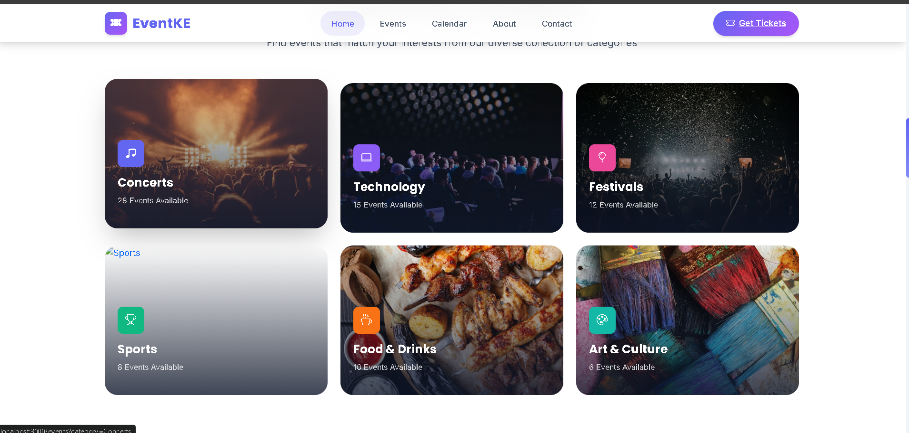
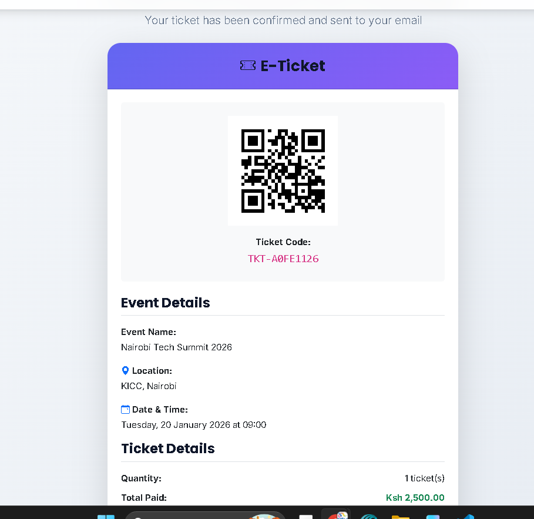
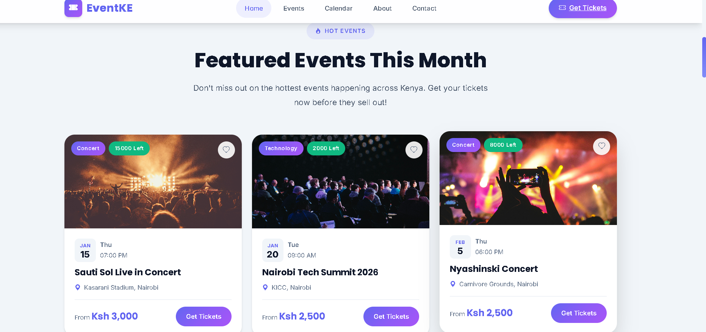

<p align="center">
  
</p>

<h1 align="center">🎫 Tiketi Afrika</h1>

<p align="center">
  <strong>Experience Africa's Finest Events</strong><br>
  A modern full-stack event ticketing platform celebrating African culture, music, and experiences
</p>

<p align="center">
  
  
  
  
</p>

<p align="center">
  <a href="#-features">Features</a> •
  <a href="#-screenshots">Screenshots</a> •
  <a href="#-quick-start">Quick Start</a> •
  <a href="#-api">API</a> •
  <a href="#-team">Team</a>
</p>

---

## 🌍 About The Project

<table>
<tr>
<td width="60%">

**Tiketi Afrika** is a comprehensive event ticketing platform designed specifically for the African market. From vibrant music festivals in Nairobi to cultural celebrations on the coast of Mombasa, our platform connects people with unforgettable experiences across Kenya and beyond.

### Why Tiketi Afrika?

- 🎭 **94+ Curated Events** - Handpicked experiences across Kenya
- 💰 **Local Currency** - All prices in KES (Kenyan Shillings)
- 📱 **Mobile-First Design** - Seamless experience on any device
- ⚡ **Instant QR Tickets** - No printing needed, just scan and enter
- 🔒 **Secure Transactions** - Your data is always protected

</td>
<td width="40%">


</td>
</tr>
</table>

---

## ✨ Features

<table>
<tr>
<td align="center" width="25%">
<br>
<strong>Browse Events</strong><br>
<sub>Discover events by category, location, or date</sub>
</td>
<td align="center" width="25%">
<br>
<strong>Easy Checkout</strong><br>
<sub>Seamless ticket purchasing experience</sub>
</td>
<td align="center" width="25%">
<br>
<strong>QR Code Tickets</strong><br>
<sub>Instant digital tickets on your phone</sub>
</td>
<td align="center" width="25%">
<br>
<strong>Event Calendar</strong><br>
<sub>Plan your month with calendar view</sub>
</td>
</tr>
</table>

### 🎯 Core Functionality

| Feature | Description |
|---------|-------------|
| 🎫 **Event Browsing** | View events from Nairobi, Mombasa, Kisumu, and other Kenyan cities |
| 📊 **Real-time Availability** | Live ticket availability tracking |
| 🔒 **Secure Purchasing** | Safe and reliable ticket purchase system |
| 📱 **QR Code Tickets** | Automatic generation of scannable QR codes |
| 📅 **Event Calendar** | Interactive calendar view for event planning |
| 🎨 **Modern UI** | Beautiful, responsive design with gradient themes |
| 🔍 **Smart Search** | Filter events by category, location, and date |
| 📧 **Email Notifications** | Instant ticket confirmation emails |

---

## 📸 Screenshots

### 🏠 Home Page
<p align="center">
  
</p>
<p align="center"><em>Modern hero section with animated carousel featuring African events</em></p>

### 🎪 Events Page
<p align="center">
  
</p>
<p align="center"><em>Browse 94+ events with powerful filtering and search</em></p>

### 🛒 Checkout Experience
<table>
<tr>
<td width="50%">

<p align="center"><em>Clean checkout form</em></p>
</td>
<td width="50%">

<p align="center"><em>Digital QR ticket confirmation</em></p>
</td>
</tr>
</table>

### 📅 Calendar View
<p align="center">
  
</p>
<p align="center"><em>Interactive calendar for planning your events</em></p>

### 👥 About & Team
<table>
<tr>
<td width="50%">

<p align="center"><em>Our story and mission</em></p>
</td>
<td width="50%">

<p align="center"><em>Meet the founding team</em></p>
</td>
</tr>
</table>

### 📱 Mobile Responsive
<p align="center">
  
  
  
</p>
<p align="center"><em>Fully responsive design for all devices</em></p>

---

## 🚀 Quick Start

### Prerequisites

```bash
# Required software
✅ Java 11+
✅ Node.js 14+
✅ Maven 3.6+
```

### 🖥️ Backend Setup

```bash
# Navigate to backend
cd backend

# Run with Maven
mvn spring-boot:run

# Backend will start at http://localhost:8080
```

### 🎨 Frontend Setup

```bash
# Navigate to frontend
cd frontend

# Install dependencies
npm install

# Start development server
npm start

# Frontend will start at http://localhost:3000
```

### ✅ Verify Installation

| Service | URL | Status |
|---------|-----|--------|
| Frontend | http://localhost:3000 | React App |
| Backend API | http://localhost:8080/api | REST API |
| H2 Console | http://localhost:8080/h2-console | Database |

---

## 🛠️ Technology Stack

<table>
<tr>
<td align="center" width="50%">

### Backend


- **Spring Boot 2.7.18** - Application framework
- **Spring Data JPA** - Database operations
- **H2 Database** - In-memory database
- **Maven** - Build management

</td>
<td align="center" width="50%">

### Frontend


- **React 18** - UI framework
- **React Router 6** - Navigation
- **Bootstrap 5** - CSS framework
- **QRCode.react** - QR generation

</td>
</tr>
</table>

---

## 📁 Project Structure

```
🎫 Tiketi Afrika/
│
├── 📂 backend/                      # Spring Boot API
│   ├── 📂 src/main/java/com/codestars/ticketing/
│   │   ├── 🚀 EventTicketingApplication.java
│   │   ├── 📂 model/                # JPA Entities
│   │   │   ├── User.java
│   │   │   ├── Event.java
│   │   │   └── Ticket.java
│   │   ├── 📂 repository/           # Data Access
│   │   ├── 📂 service/              # Business Logic
│   │   ├── 📂 controller/           # REST Endpoints
│   │   └── 📂 config/               # Configuration
│   └── 📄 pom.xml
│
├── 📂 frontend/                     # React SPA
│   ├── 📂 src/
│   │   ├── 📂 components/           # Reusable UI
│   │   │   ├── Navbar.js
│   │   │   ├── Footer.js
│   │   │   ├── EventCard.js
│   │   │   └── TicketConfirmation.js
│   │   ├── 📂 pages/                # Page Components
│   │   │   ├── HomePage.js
│   │   │   ├── EventsPage.js
│   │   │   ├── AboutPage.js
│   │   │   └── CalendarPage.js
│   │   ├── 📂 styles/               # CSS Themes
│   │   └── App.js
│   └── 📄 package.json
│
└── 📂 documentation/                # Docs & Assets
    ├── 📂 screenshots/              # UI Screenshots
    ├── 📄 Project_Report.md
    └── 📄 Postman_Collection.json
```

---

## 🔌 API Reference

### Events Endpoints

```http
GET /api/events              # Get all events
GET /api/events/{id}         # Get event by ID
GET /api/events/categories   # Get all categories
GET /api/events/locations    # Get all locations
```

### Tickets Endpoints

```http
POST /api/ticket/purchase    # Purchase ticket
GET /api/ticket/{code}       # Get ticket by code
```

### Example Response

```json
{
  "id": 1,
  "name": "Nairobi Tech Summit 2026",
  "location": "KICC, Nairobi",
  "eventDate": "2026-03-15T09:00:00",
  "priceKES": 5000.0,
  "category": "Technology",
  "availableTickets": 500,
  "imageUrl": "https://example.com/event.jpg"
}
```

---

## 🎭 Featured Events

<table>
<tr>
<td align="center" width="33%">

<br><strong>Tech Summit</strong>
<br><sub>KICC, Nairobi</sub>
</td>
<td align="center" width="33%">

<br><strong>Afro Beats Festival</strong>
<br><sub>Carnivore, Nairobi</sub>
</td>
<td align="center" width="33%">

<br><strong>Cultural Festival</strong>
<br><sub>Bomas of Kenya</sub>
</td>
</tr>
</table>

---

## 🌟 User Journey

```
🏠 Home Page  →  🎪 Browse Events  →  🎫 Select Event  →  🛒 Checkout  →  📱 QR Ticket  →  🎉 Enjoy!
```

| Step | Action | Result |
|------|--------|--------|
| 1️⃣ | Visit homepage | See featured events & hero carousel |
| 2️⃣ | Browse events | Filter by category, location, or search |
| 3️⃣ | Select event | View details, pricing, availability |
| 4️⃣ | Checkout | Enter details, select quantity |
| 5️⃣ | Get ticket | Receive instant QR code ticket |

---

## 👥 The Team

<table>
<tr>
<td align="center" width="20%">

<br><strong>Kuldon Kiariga</strong>
<br><sub>CEO & Founder</sub>
</td>
<td align="center" width="20%">

<br><strong>Robinson Crusoe</strong>
<br><sub>CTO</sub>
</td>
<td align="center" width="20%">

<br><strong>Joseph Chacha</strong>
<br><sub>Head of Operations</sub>
</td>
<td align="center" width="20%">

<br><strong>Levi Njoroge</strong>
<br><sub>Lead Developer</sub>
</td>
<td align="center" width="20%">

<br><strong>Gaudencia Omondi</strong>
<br><sub>Marketing Director</sub>
</td>
</tr>
</table>

---

## 🔮 Future Roadmap

- [ ] 💳 **M-Pesa Integration** - Native mobile money payments
- [ ] 🔐 **User Authentication** - JWT-based login system
- [ ] 📊 **Admin Dashboard** - Event management portal
- [ ] 📧 **SMS Notifications** - Ticket alerts via SMS
- [ ] 🎯 **Seat Selection** - Interactive venue maps
- [ ] 🎁 **Discount Codes** - Promotional pricing
- [ ] 🌐 **Multi-language** - Swahili & English support

---

## 📄 License

This project is created for educational purposes.

---

<p align="center">
  
</p>

<p align="center">
  <strong>🌍 Built with ❤️ for African Events</strong>
</p>

<p align="center">
  <sub>© 2025 Tiketi Afrika. Celebrating African Culture, One Event at a Time.</sub>
</p>

---

<p align="center">
  <a href="#-tiketi-afrika">⬆️ Back to Top</a>
</p>
